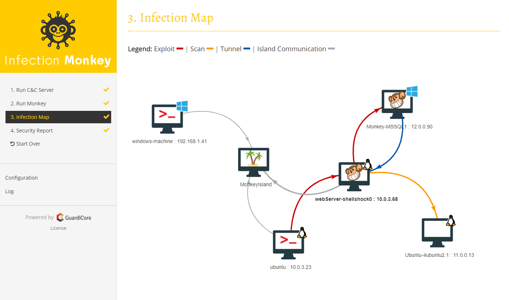
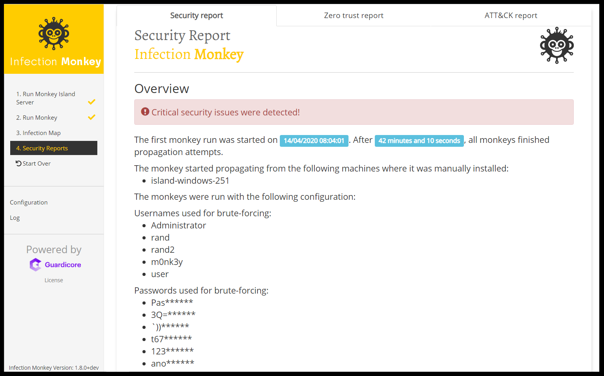

# Infection Monkey

## Data Center Security Testing Tool

Welcome to the Infection Monkey!

The Infection Monkey is an open-source security tool for testing a data center's resiliency to perimeter breaches and internal server infection. The Monkey uses various methods to self-propagate across a data center and reports success to a centralized Monkey Island server.

The Infection Monkey is comprised of two parts:

* **Monkey** - A tool that infects other machines and propagates to them.
* **Monkey Island** - A dedicated server to control and visualize the Infection Monkey's progress inside the data center.

To read more about the Monkey, visit [akamai.com/infectionmonkey](https://www.akamai.com/infectionmonkey).

## Screenshots

### Map

### Security report

## Main Features

The Infection Monkey uses the following techniques and exploits to propagate to other machines.

* Multiple propagation techniques:
  * Predefined passwords
  * Common logical exploits
  * Password stealing using Mimikatz
* Multiple exploit methods:
  * SSH
  * SMB
  * WMI
  * Log4Shell
  * Zerologon
  * and more, see our [documentation hub](https://techdocs.akamai.com/infection-monkey/docs/exploiters/) for more information.

## Setup
Check out the [Setup](https://techdocs.akamai.com/infection-monkey/docs/setting-up-infection-monkey/) page and the [Getting Started](https://techdocs.akamai.com/infection-monkey/docs/getting-started/) guide in our documentation.

The Infection Monkey supports a variety of platforms, documented [in our documentation hub](https://techdocs.akamai.com/infection-monkey/docs/operating-systems/).

## Building the Monkey from the source
To deploy the development version of Monkey you should refer to readme in the [deployment scripts](deployment_scripts)
folder or follow the documentation in the [documentation hub](https://techdocs.akamai.com/infection-monkey/docs/development-setup/).

### Build status
| Branch | Status |
| ------ | :----: |
| Develop |  |
| Master |  |

## Tests

### Unit Tests

In order to run all of the Unit Tests, run the command `python -m pytest` in the `monkey` directory.

To get a coverage report, first make sure the `coverage` package is installed using `pip install coverage`. Run the command
`coverage run -m unit test` in the `monkey` directory and then `coverage html`. The coverage report can be found in
`htmlcov.index`.

### Blackbox tests

In order to run the Blackbox tests, refer to `envs/monkey_zoo/blackbox/README.md`.

# License

Copyright (c) Guardicore Ltd

See the [LICENSE](LICENSE) file for license rights and limitations (GPLv3).
