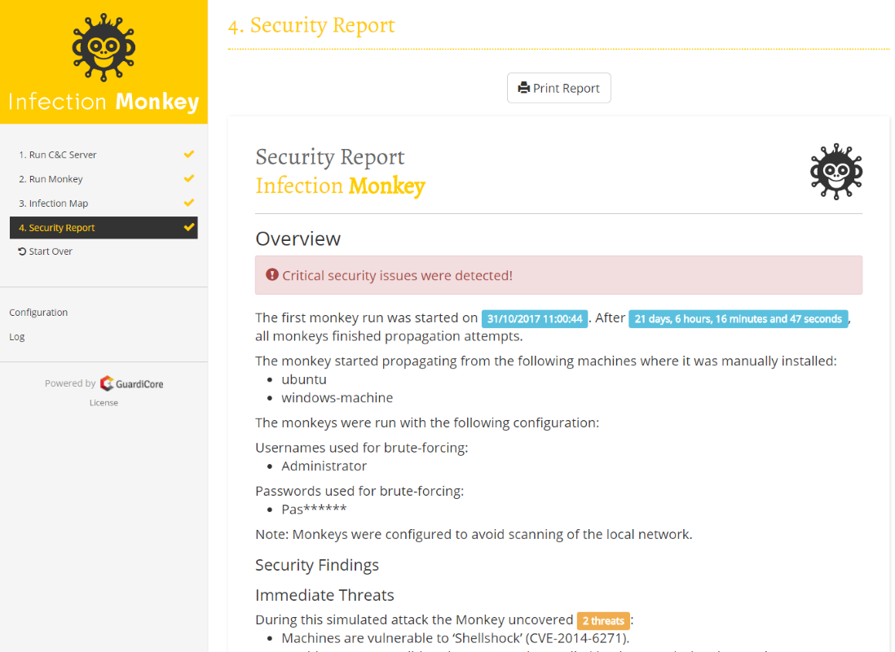

Infection Monkey
====================

### Data center Security Testing Tool
------------------------

Welcome to the Infection Monkey! 

The Infection Monkey is an open source security tool for testing a data center's resiliency to perimeter breaches and internal server infection. The Monkey uses various methods to self propagate across a data center and reports success to a centralized Monkey Island server.

The Infection Monkey is comprised of two parts:
* Monkey - A tool which infects other machines and propagates to them
* Monkey Island - A dedicated server to control and visualize the Infection Monkey's progress inside the data center

To read more about the Monkey, visit http://infectionmonkey.com 

Main Features
---------------

The Infection Monkey uses the following techniques and exploits to propagate to other machines.

* Multiple propagation techniques:
  * Predefined passwords
  * Common logical exploits
  * Password stealing using Mimikatz
* Multiple exploit methods:
  * SSH
  * SMB
  * RDP
  * WMI
  * Shellshock
  * Conficker
  * SambaCry
  * Elastic Search (CVE-2015-1427)

Setup
-------------------------------
Check out the [Setup](https://github.com/guardicore/monkey/wiki/setup) page in the Wiki or a quick getting [started guide](https://www.guardicore.com/infectionmonkey/wt/).

Building the Monkey from source
-------------------------------
If you want to build the monkey from source, see [Setup](https://github.com/guardicore/monkey/wiki/Setup#compile-it-yourself)
and follow the instructions at the readme files under [infection_monkey](infection_monkey) and [monkey_island](monkey_island). 

License
=======
Copyright (c) 2017 Guardicore Ltd

See the [LICENSE](LICENSE) file for license rights and limitations (GPLv3).
